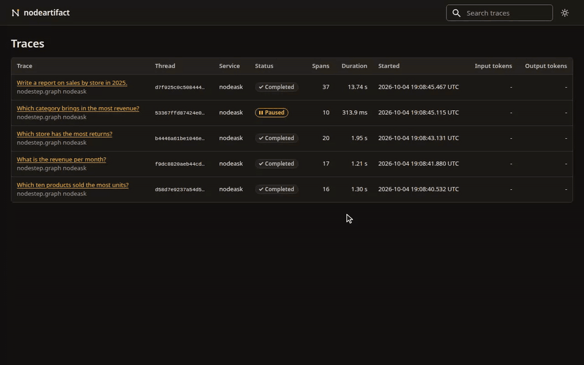

<picture>
  <source media="(prefers-color-scheme: dark)" srcset="assets/nodeartifact-dark.svg">
  
</picture>

# nodeartifact

> [!WARNING]
> Alpha (0.1.0a1). Anything may change between releases without a deprecation period, so pin a tag or a commit.

Tracing for [nodestep](https://github.com/nodestep-ai/nodestep) graphs. `instrument()` records every run, node, model call and tool call as OpenTelemetry spans, and `nodeartifact serve` stores them in SQLite and shows them in a local web UI. The server accepts OTLP/HTTP traces from any other OpenTelemetry code too.



## Install

nodeartifact needs Python 3.12 or later. It is not on PyPI yet, so you install it from GitHub.

```sh
uv add "nodeartifact[server] @ git+https://github.com/nodestep-ai/nodeartifact"
```

`configure()` and `instrument()` need only the base package. The `server` extra adds `nodeartifact serve`.

To run the server without adding it to a project:

```sh
uvx --from "nodeartifact[server] @ git+https://github.com/nodestep-ai/nodeartifact" nodeartifact serve
```

## Quick start

Start the server:

```sh
uv run nodeartifact serve
```

Then run a graph through `instrument()`. `ScriptedChat` plays the model, so no API key is needed.

```python
import asyncio

from nodestep import ScriptedChat, build_react_agent, run_agent

import nodeartifact

agent = build_react_agent(ScriptedChat(["Order A-1001 has shipped."]), tools=[])

provider = nodeartifact.configure("http://127.0.0.1:4318", service_name="my-app")
traced = nodeartifact.instrument(agent, tracer_provider=provider)
print(asyncio.run(run_agent(traced, "Where is order A-1001?", thread_id="order-1")))
provider.shutdown()
```

It prints `Order A-1001 has shipped.`, and the run shows up at http://127.0.0.1:4318/.

- `configure()` does not set the global OpenTelemetry provider, so pass it to `instrument()`.
- `provider.shutdown()` sends the last spans before the script exits.
- Spans go out every 5 seconds. Pass `schedule_delay_millis=500` to `configure()` to watch a run as it goes.

## Documentation

https://nodestep-ai.github.io/nodestep/nodeartifact/

It covers what a run records, sending traces from other code, the web UI, the server options, security and Docker.

## Development

`uv.lock` pins nodestep to a commit on GitHub. To work against a nodestep checkout next to this one, install it in its place:

```sh
git clone https://github.com/nodestep-ai/nodestep
git clone https://github.com/nodestep-ai/nodeartifact
cd nodeartifact
uv sync --locked --all-extras --no-install-package nodestep
uv pip install -e ../nodestep
uv run --no-sync pytest -q
uv run --no-sync ruff check .
uv run --no-sync ruff format --check .
uv run --no-sync ty check .
```

`nodestep.css`, `nodestep-theme.js` and `nodestep-data.js` in `src/nodeartifact/server/static/` are copies of the files in [nodestep-stylesheet](https://github.com/nodestep-ai/nodestep-stylesheet); change them there.

`docs/` is the nodeartifact section of the nodestep docs site. nodestep's `mkdocs.yml` lists its pages, so a page added, renamed or removed here needs the same change there, or nodestep's strict docs build fails. Doc changes go live on the next nodestep push to `main`, or when nodestep's Docs workflow is run by hand.

Add a line under `## [Unreleased]` at the top of [CHANGELOG.md](https://github.com/nodestep-ai/nodeartifact/blob/main/CHANGELOG.md) for each user-visible change; add the heading if it is not there. CI makes the releases: when CI passes on a `main` commit whose newest `## [X.Y.Z] - YYYY-MM-DD` section has no tag yet, `.github/workflows/release.yml` checks that version against `pyproject.toml`, tags `vX.Y.Z` and creates a GitHub release with that section as the notes. Nothing goes to PyPI.

## License

MIT. See [LICENSE](https://github.com/nodestep-ai/nodeartifact/blob/main/LICENSE).
